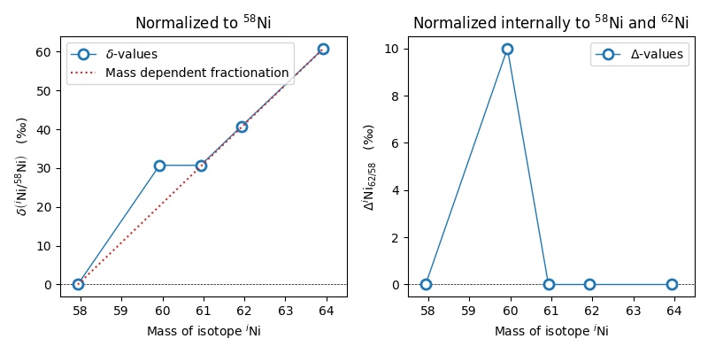

Background information
======================

This section serves
to further explain details of the databases and notations
in a scientific concept.
Here,
background information is given
that can help the user to better understand
the various elements of the package
and the logic behind it.
Usage of the module is not discussed here.

Databases
---------

Currently,
the default database that is loaded
is "lodders09".

"lodders09"
~~~~~~~~~~~

The database named "lodders09"
is based on the work by
`Lodders et al. (2009) <https://doi.org/10.1007/978-3-540-88055-4_34>`_.
This database is **loaded by default**,
unless a different database is specified.

The measurements loaded when "lodders09" is selected
are the data in Table 10
for elements and isotopes.
The elemental abundances are simply gained
by adding up the isotopic abundances.
Note that this introduces a total abundance of Si
that is 999700,
which is within uncertainties
equal to 10\ :sup:`6`.

The solar abundances loaded with Lodders et al. (2009)
are nuclide abundances 4.56 Ga ago.

.. note:: The nuclide abundance
  of :sup:`138`\La in Table 10
  of Lodders et al. (2009)
  is given as 0.000.
  This seems to be an error originating
  too few significant figures.
  Using the atom percentages
  and the nuclide abundance for
  :sup:`139`\La,
  we calculated a nuclide abundance
  of 0.0004 for :sup:`138`\La
  and used this calculated abundance
  for our database.

"asplund09"
~~~~~~~~~~~

The database named "asplund09"
is based on the work by
`Asplund et al. (2009) <https://doi.org/10.1146/annurev.astro.46.060407.145222>`_.

The loaded elemental abundances are taken from Table 1
in Asplund et al. (2009)
and represent the present-day solar photosphere
(column "Photosphere").
The isotope abundances are taken from Table 3
in Asplund et al. (2009) and are
the representative isotopic abundance fractions
in the Solar System.
According to the authors,
most isotopic values are taken from
`Rosman & Taylor (1998) <https://doi.org/10.1063/1.556031>`_
with some updates discussed in Section 3.10
of Asplund et al. (2009).

"nist"
~~~~~~

The database named "nist"
is based on the online-available abundance table
of the National Institute of Standards and Technology.
The database can be found
`here <https://www.nist.gov/pml/atomic-weights-and-isotopic-compositions-relative-atomic-masses>`_.

To directly quote the database:
"In the opinion of the Subcommittee for Isotopic Abundance Measurements (SIAM),
these values represent the isotopic composition
of the chemicals and/or materials most commonly encountered in the laboratory.
They may not, therefore,
correspond to the most abundant natural material.
The uncertainties listed in parenthesis
cover the range of probable variations of the materials
as well as experimental errors.
These values are consistent
with the values published in Isotopic Compositions of the Elements 2009."

More details can be found
`here <https://www.nist.gov/pml/atomic-weights-and-isotopic-compositions-column-descriptions#comp>`_.

Notations
---------

δ-values
~~~~~~~~

The δ-value of a given isotope ratio,
generally used in cosmo- and geochemistry,
is defined as:

.. math::

  \delta \left( \frac{^{i}X}{^{j}X} \right) =
  \left(\frac{\left(\frac{^{i}X}{^{j}X}\right)_{\mathrm{measured}}}
  {\left(\frac{^{i}X}{^{j}X}\right)_{\mathrm{solar}}} -
  1\right) \times f

Here,
the measured isotope ratio
of element X and isotopes :math:`i` and :math:`j`
represents the ratio as measured in a stardust grain
or as modeled in a stellar model.
The solar isotope ratio for the same isotope ratio
is the one chosen from the database.

Subtracting unity form the ratio of ratios
determines the deviation of the measurement
from the solar abundance.

.. note:: The part of the equation in parenthesis should
  correctly be referred to as the δ-value,
  i.e.,
  the δ-value is defined when setting :math:`f=1`.

This is important to remember.
However,
many measurements,
especially of stardust,
are expressed in parts per thousand or per mil.
This means that the δ-value must be multiplied
by a factor :math:`f=1000`.

On the other hand,
bulk measurements of meteorites generally detect
smaller deviations from solar.
Thus,
such measurements are often expressed
in so-called ε- or µ-values.
These generally only differ from the δ-value
by using a different factor :math:`f`.
The table below gives an overview
of different notations
and the respective :math:`f`-values:

.. list-table::
   :widths: 50 50
   :header-rows: 1

   * - Notation
     - :math:`f`-value
   * - absolute deviation
     - 1
   * - %, percent
     - 100
   * - ‰, per mil
     - 1,000
   * - ε, parts per ten thousand
     - 10,000
   * - µ, parts per one-hundred thousand
     - 100,000
   * - ppm, parts per million
     - 1,000,000
   * - ppb, parts per trillion
     - 1, 000,000,000
   * - ppt, parts per trillion
     - 1,000,000,000,000

Internal normalization
~~~~~~~~~~~~~~~~~~~~~~

In cosmo- and geochemistry,
measured isotope ratios
are often internally normalized.
This is especially true for measurements
that suffer from mass-dependent fractionation.

Above figure shows an example
of the two normalization scenarios.
On the left side is
the regular δ-value notation
as described above.
As the normalization isotope,
:sup:`58`\ Ni is chosen.
The red, dashed line
shows the internal,
mass-dependent fractionation
that was introduced into the system artificially.
Clearly,
:sup:`60`\ Ni shows some positive
deviation from this line.
After internal normalization,
a clear excess in :sup:`60`\ Ni
can be seen in the figure.

Internal normalization
(right side)
normalizes the same dataset
to a second isotope.
Here, :sup:`62`\ Ni is chosen.
Assuming that any anomaly in :sup:`62`\ Ni
is due to mass-dependent fractionation,
all isotope ratios can be corrected
for this mass-dependent fractionation.
To do so,
a mass-dependent fractionation law
must be applied.
These,
internally normalized values,
if expressed in permil,
are often described with
a capital delta (Δ).

.. note:: The same pre-factors
  as discussed above are applied
  for internal normalization.
  Often, measurements obtained using
  inductively-coupled plasma mass spectrometry (ICP-MS)
  are internally normalized
  and results are expressed in
  ε- (parts per 10,000)
  or µ-values (parts per 100,000).
  Note that the same notation
  is frequently used
  for both normalizations.

A detailed description on
mass fractionation laws can be found in
`Dauphas and Schauble (2016) <https://doi.org/10.1146/annurev-earth-060115-012157>`_.

In the ``iniabu`` package,
corrections using an exponential (default)
and linear law
can be applied.

The **exponential law**,
which is applied by default,
assumes an exponential relation
for the mass dependent mass fractionation.
Let us assume the example from the above figure.
The major normalization isotope :sup:`j`\ Ni
here is :sup:`58`\ Ni,
the minor normalization isotope :sup:`i`\ Ni
is :sup:`62`\ Ni.
For a given sample,
an exponential factor β
can be calculated as:

.. math::

  \beta = \frac{\log(^{i}\mathrm{Ni}/^{j}\mathrm{Ni})_{\mathrm{sample}}/
                \log(^{i}\mathrm{Ni}/^{j}\mathrm{Ni})_{\mathrm{solar}}}
               {\log(m_{i} / m_{j})}

Using this exponential factor,
the mass-dependent fractionation corrected value
of an isotope ratio of interest,
e.g.,
:sup:`x`\ Ni/:sup:`j`\ Ni
can be calculated as:

.. math::

  \left(\frac{^{x}\mathrm{Ni}}{^{j}\mathrm{Ni}}\right)_{\mathrm{sample}}^{*}
  = \frac{(^{x}\mathrm{Ni}/^{j}\mathrm{Ni})_{\mathrm{sample}}}
         {(m_{x} / m_{j})^{\beta}}

Using this corrected ratio,
the Δ-value can be calculated as:

.. math::

  \Delta^{x}\mathrm{Ni}_{i/j}
  = \left(\frac{(^{x}\mathrm{Ni} / ^{j}\mathrm{Ni})_{\mathrm{sample}}^{*}}
               {(^{x}\mathrm{Ni} / ^{j}\mathrm{Ni})_{\mathrm{solar}}} - 1
    \right) \times k

Here :math:`k` is the delta factor
and defines the unit as described
above for δ-values.

The **linear law**
to correct for mass-dependent fractionation
can be calculated as following:

.. math::

  \Delta^{x}\mathrm{Ni}_{i/j}
  = \delta^{x}\mathrm{Ni}_{j}
    - \frac{m_{j} - m_{x}}{m_{j} - m_{i}} \times \delta^{i}\mathrm{Ni}_{j}

Here,
:math:`^{x}\mathrm{Ni}_{j}`
is short for the ratio
:math:`^{x}\mathrm{Ni}/^{j}\mathrm{Ni}`.

The delta factor :math:`k`
is part of the δ-value calculation.
With the linear law,
values smaller than  -(delta factor)
are theoretically possible,
however,
such values are unphysical.
The ``iso_int_norm`` routine
automatically detects such values
and sets them to the minimal possible value
of -(delta factor).
